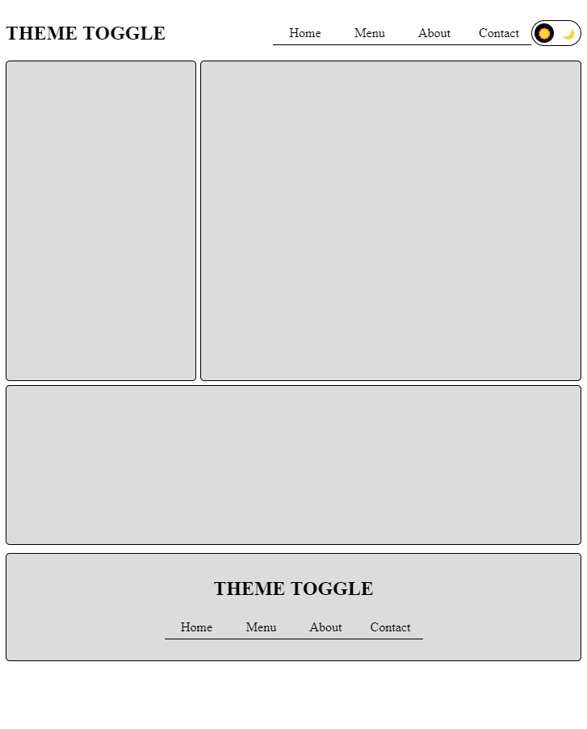
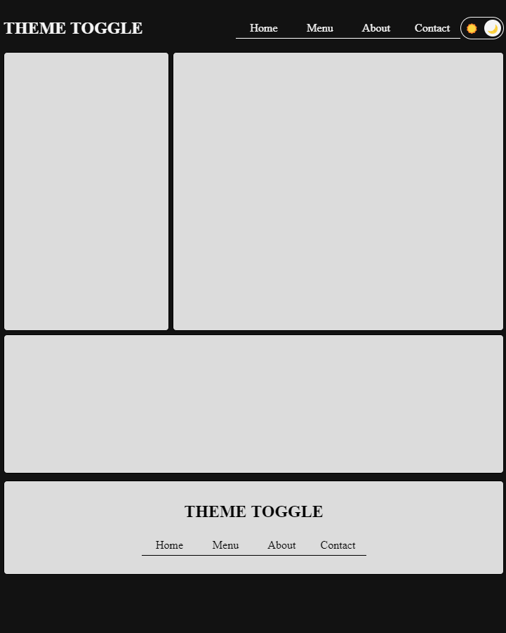

# 🌗 Theme Toggle App

A minimal light/dark theme switcher using pure HTML, CSS, and JavaScript.

## 🔗 Live Demo

[👉 View the demo](https://nickolaidev.github.io/project-theme-toggle/)

## 🚀 Technologies Used

- HTML5
- CSS3 (custom properties for theme)
- Vanilla JavaScript

## ⚙️ Features

- Toggle between light and dark mode
- Saves user preference in `localStorage`
- Smooth transition between themes

## 📚 What I Learned

- Working with CSS variables (`--color`)
- Implementing theme persistence with `localStorage`
- Adding transition effects for UI changes

---

© 2025 NikolaiDev
